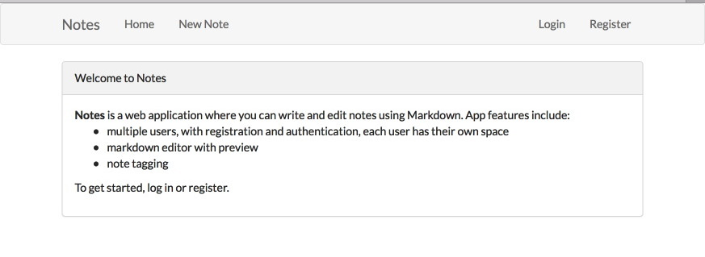
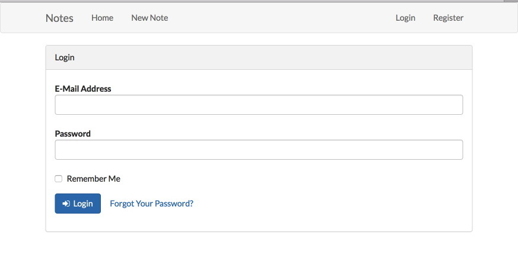
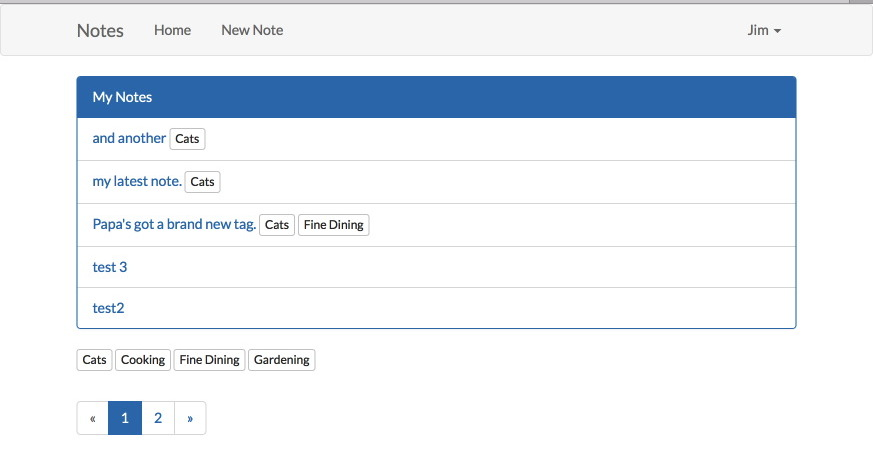
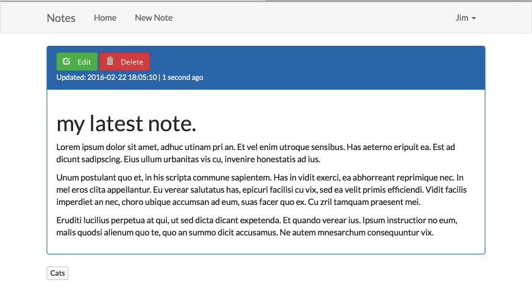

Notes
======
a web application for keeping and organizing notes

author: Jim Witte jim@thunderingbison.com  
date: Feb 22 2016

About
-----
I wrote this app as a project to become familiar with the Laravel framework. I used Laravel 5.2, along with several composer packages including:

* graham-campbell/markdown : provides a markdown editor integrated with bootstrap
* rtconner/laravel-tagging : provides database and methods for tagging objects in Laravel

What I learned
--------------
* Laravel basic MVC organization, including views, routes, controllers, middleware, requests
* managing dependencies using Composer
* basics of working with sqlite3
* working with Laravel views, passing data to views
* working with Laravel authentication
* sorting & filtering Laravel database search results
* practice working with bootstrap

Special Thanks
--------------
Special thanks to Jeffery Way at <http://www.laracasts.com> for the helpful instructional videos about Laravel.

Installation Requirements
-------------------------
* Laravel 5.2 server requirements <https://laravel.com/docs/5.2#server-requirements>
* composer
* sqlite3

Installation
-------------
* web root should be pointed at the "public" folder
* install dependencies using Composer (php composer install)
* create a blank database in the database folder (touch database.sqlite). Web user must have write access to this file, and sqlite3 must be available.
* create database tables using migrations (php artisan migrate)
* to send mail, you'll need to check the email configuration at: app/config/mail.php.

Screenshots
-----------
  
  
  
  

